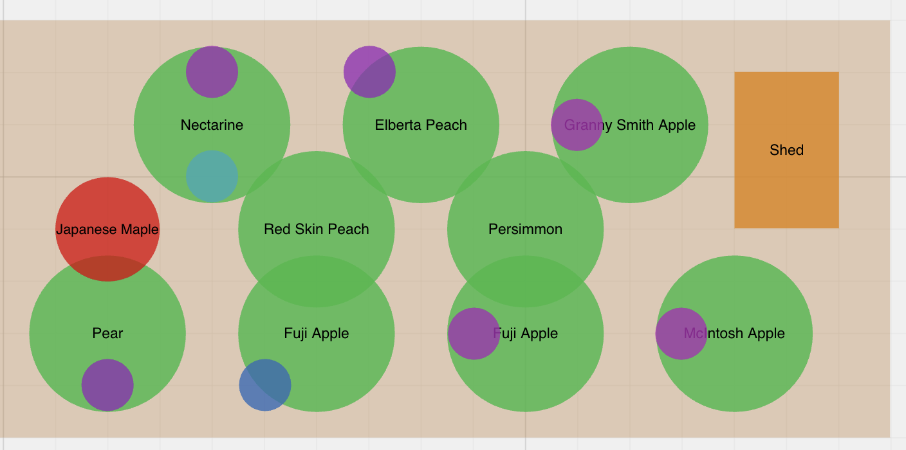
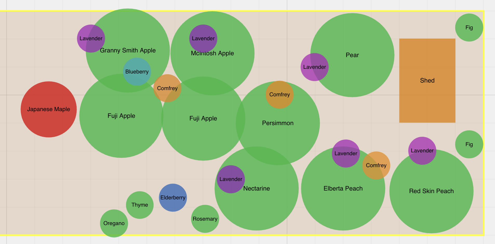
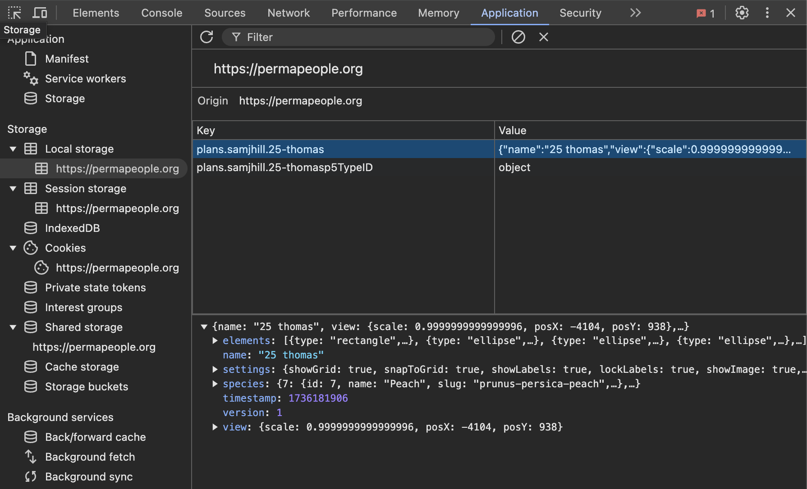

# Permaplot: Permaculture Advice

Analyzes your garden with the goal of improving its performance, with an eye toward permaculture principles.

## Example Output

Initial garden plan:



To optimize your garden layout for improved growth and yield, here are several suggestions tailored to Zone 7, integrating permaculture principles:

### Plant Spacing and Arrangement
1. **Re-evaluate Tree Spacing**: Ensure that each tree, especially fruit-bearing ones, has enough space for root expansion and canopy growth. For your layout, consider a minimum of around 15-20 feet between each tree for optimal air circulation and sunlight exposure.

2. **Companion Planting**:
    - **Persimmon and Persimmon-companion Plants**: Consider underplanting with comfrey, which can enhance nutrient availability for the persimmon while serving as a pollinator attractant.
    - **Lavender**: Works well as a companion for many fruit trees by attracting pollinators and repelling some pests. Given its presence near multiple fruit trees, consider maintaining its position.
    - **Blueberries (Northern Highbush Blueberry)**: They prefer acidic soil conditions and can benefit from mulching with acidic materials. Pair with comfrey and low-growing ericaceous plants that do not compete for root space.

3. **Strategic Plant Groupings**: Group trees like apples (Granny Smith, McIntosh), peaches (Elberta, Red Skin), and nectarines together with appropriate spacing and compatible guild plantings underneath to improve symbiosis and efficiency.

### Sunlight Exposure
- **Orient Trees**: Avoid shade competition by ensuring taller trees are placed optimally so they do not overshadow shorter or sun-loving plants. Ensure south-facing exposure for high sunlight requirements, like for peaches and nectarines.

### Irrigation Efficiency
1. **Drip Irrigation System**: Implementing a drip system will ensure consistent and efficient water distribution, helping reduce evaporation. It is particularly beneficial for the Mediterranean plants like lavender.

2. **Mulching**: Use organic mulch around the base of trees and shrubs to retain moisture and reduce water loss, particularly crucial during dry spells in zone 7.

### Accessibility and Maintenance
1. **Pathways**: Clearly define paths with mulch or stepping stones to ensure easy access for maintenance and harvesting without compacting the soil around crucial root zones.

2. **Raised Beds for Underplanting**: Consider adding raised beds for herbs or companion plants among the fruit trees to facilitate maintenance.

### Underplanting Suggestions
- **Herbs like Thyme and Oregano**: These can serve both as underplantings to attract beneficial insects and as culinary assets.
- **Comfrey**: Excellent for nitrogen fixing and as a ground cover under taller trees.
- **Clover**: Acts as a ground cover and nitrogen fixer, which can support fruit trees.

### Adjustments
- **Reassess Elderberry Positioning**: Given that Elderberry can grow quite large, ensure it is placed to allow for easy maintenance access and to prevent shading more light-demanding plants.

By implementing these adjustments and observations into your garden's design, you can enhance productivity, maintain biodiversity, and improve the overall sustainability of your permaculture system.


Garden plan updated with this advice:




## Application Setup

Set up your python virtual environment:

```shell
virtualenv env
source env/bin/activate
pip install -r requirements.txt
```

Set up your API key:

```shell
nano .env
```

Paste your OpenAI API key in:

```
OPENAI_API_KEY=....
```

## Running it

Create a garden plan at [Permapeople.org](https://permapeople.org/plans/new) and save it. 


Open up the developer tools, go to the Application tab, and copy the json blob contained in the `value` field into save-data.json (located in the root of this project).



```shell
python3 -m main
```

